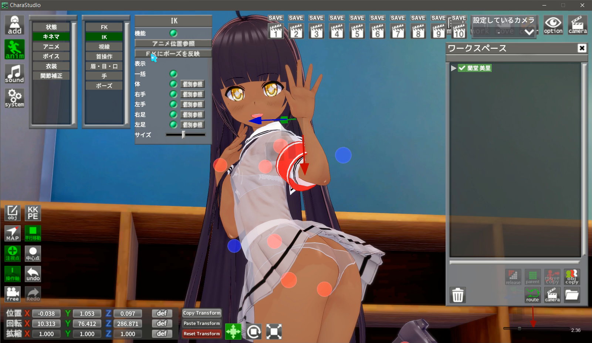
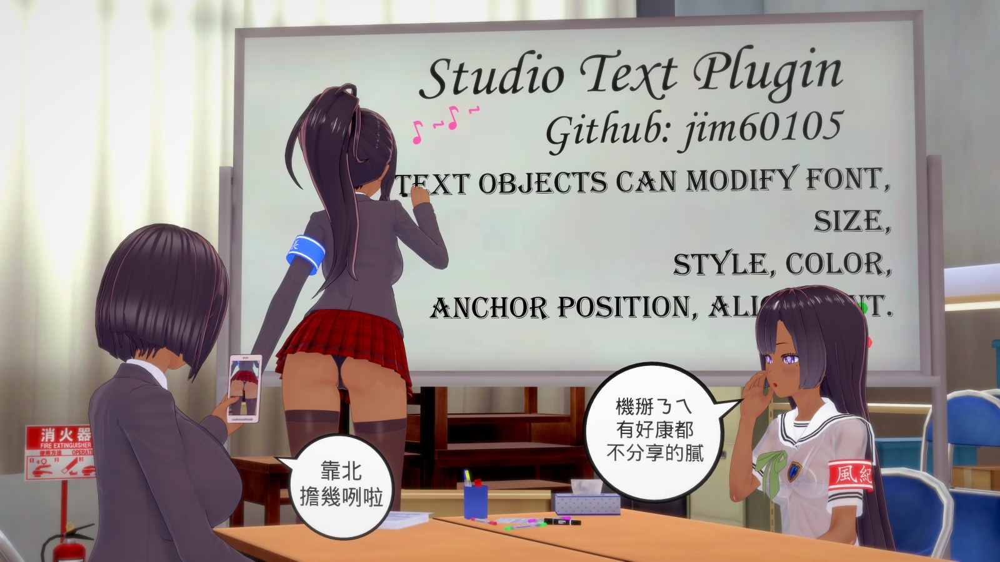
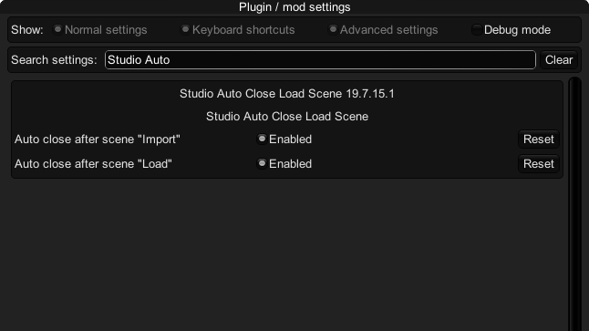
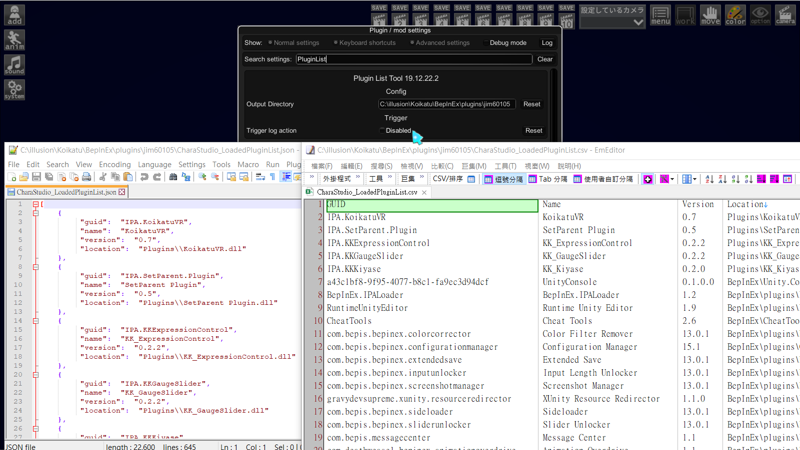
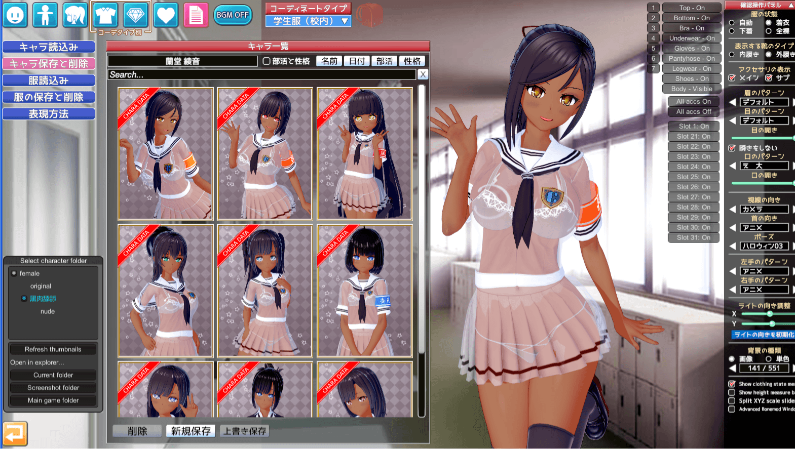
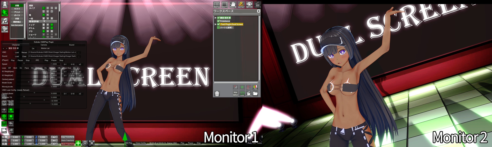

 本著作係採用<a rel="license" href="LICENSE.html">創用 CC 姓名標示-非商業性-相同方式分享 3.0 台灣 授權條款</a>授權.

# Studio服裝卡選擇性載入插件 Studio Coordinate Load Option
 

- Studio的服裝卡讀取處，多一個選項盤可以選擇性載入服裝 
- 飾品可選擇「取代模式」和「增加模式」 
(取代模式會複寫同欄位的飾品，而增加模式會往空欄位一直附加上去)
- 「鎖定頭髮飾品」可將頭髮飾品鎖定，使之不會受到清除和複寫 
- **將「鎖定頭髮飾品」以外的選項全勾，並使用飾品「取代模式」即會調用遊戲原始程式碼** 

目前確定支援Plugin: 
- Koikatu Overlay Mods v5.0.2
- Koikatu ABMX V3.3
- Koikatu More Accessories v1.0.6
- Koikatu MaterialEditor v1.8

目前確定不支援Plugin: 
- Koikatu HairAccessoryCustomizer

# Studio全是妹子插件 Studio All Girls Plugin
 

- 將Studio SceneData內所有男性以女性讀入 
- 身體外型依照其原始數據女體化 
- 插件可從Configuration Manager關閉功能 

以此插件可以實現跨性別替換角色卡功能 
例: 讀取一般的男女Scene，將男角色替換成女角色，就變成了百合Scene! 

### **警語**: 
1. 所有角色將以女性載入 
1. 此插件所產生之存檔，**所有角色皆會以女性存檔** 
1. POSE解鎖性別限制，男女都可讀取，寫入以女性寫入 

# Studio女體單色化插件 Studio Simple Color On Girls
 

使女性支持單色化功能，用意在於彌補全女插件所造成的限制 
可以和全女插件分開使用 
**依賴Darkness特典，無Darkness必定出問題** 

# Studio換人插件 Studio Chara Only Load Body
 

保留衣服和飾品，只替換人物 
目前確定支援Plugin: 
- Koikatu Overlay Mods v5.0.2
- Koikatu More Accessories v1.0.7
- Koikatu KK_UncensorSelector v3.8.3
- Koikatu KKABMX v3.3
- Koikatu Chara Overlays Based On Coordinate v1.1.0  (Chara Overlays跟著插件了，如果要更改載入與否請至設定修改)

# Studio IK→FK修正插件 Studio Reflect FK Fix
 
↑ 請點選圖片觀看範例影片 ↑ Click the image to watch demo! ↑  (備用載點: [影片1](demo/demo5-1.mp4) [影片2](demo/demo5-2.mp4) )

- 原始的「FKにポーズを反映」功能會複寫身體FK+脖子FK+手指FK 
→ 改成了只會複寫身體FK，脖子FK和手指FK維持原樣
- 原始的「FK 首 個別參照」功能，是直接複製アニメ的脖子方向 
→ 改成了會複製真實方向。意即可以使用「首操作 カメラ」定位後，再按我的「->FK(首)」按鈕複製至脖子FK

# Studio文字插件 Studio Text Plugin
 
↑ 請點選圖片觀看範例影片 ↑ Click the image to watch demo! ↑  (備用載點: [影片](demo/demo6.mp4)) 
- 從「add→アイテム→2D効果→文字Text」加載，右側選中後在anim選單編輯 
- 文字物件可修改字體、大小、樣式、顏色、錨點位置、對齊(換行後顯示選項) 
- 可保存文字設定，以作為NewText的預設參數 

建議分享Scene時一併分享使用的Fonts (It is recommended to share the Fonts used when sharing Scene.) 

### 注意事項: 
- Fonts會列出OS內安裝，支援Unity動態生成的所有字體，字體總數在500以下時可以顯示預覽 
- 若Scene保存後，在其他沒有安裝此Font的OS讀取，會加載MS Gothic 
- Color選取使用右下角遊戲原生Color選擇器 
- 文字中插入換行符「\n」可以換行，插入換行符後會顯示「對齊」編輯選項 
- 文字重疊時偶爾會渲染不正確，這是Unity的問題，似乎無解 

# Studio自動關閉Scene載入視窗 Studio Auto Close Loading Scene Window
 

Load Scene視窗處，在Import或Load後自動關閉視窗 
可以使用Configuration Manager個別設定Import/Load是否啟用 (預設皆啟用) 

# 插件清單工具 Plugin List Tool
 

- 此工具可導出當前遊戲中已加載的BepInEx插件和IPA插件 
- 格式為**Json和CSV** 
- 適配IPALoaderX v1.2以上版本 
- 重新Enable後會立即倒出當前加載清單

# 開門查水表！ FBI Open Up！
 
↑ 請點選圖片觀看範例影片 ↑ Click the image to watch demo! ↑  (備用載點: [影片](demo/demo9.mp4)) 
- 支援替換模板角色，例如: 
    - 若將模板自訂為巨乳姊姊，就可以轉變功能為替換成大姊姊
    - 將模板訂為三頭身(Chibi)並開啟ABMX設定，這就能成為三頭身變化功能。
- 可在Main Game、Studio、Maker和Free H內執行 
- 我置入了幾張過場圖片和動畫，作為娛樂效果

詳細說明請見 [另一篇Readme](KK_FBIOpenUp/README.md)。如果你想要使用，我很確定你需要閱讀它

# 角色Overlay隨服裝變換 Chara Overlays Based On Coordinate
 
↑ 請點選圖片觀看完整影片 ↑ Click the image to watch full video! ↑  (備用載點: [影片](demo/demo10-1.mp4)) 

- 讓所有角色Overlay(Iris、Face、Body Overlay)隨著服裝變更，反映在人物存檔(CharaFile)和服裝存檔(CoordinateFile)上 
- 此插件在「讀存」跟「切換服裝」時覆蓋Overlay，依賴KSOX運作 
- v1.2.0起支援資源重用，同樣的貼圖重複使用時只會佔一份空間 
- **產生的存檔可以和「無此插件的遊戲環境」相容**，此時KSOX儲存的Overlay會被載入 
(存檔時，當前套用的Overlay依然會儲存進去，並在無插件環境時被讀取出來) 
- v1.3.0起Iris Overlay可只覆蓋在單眼

### 注意事項: 
- 特別需求 **KKAPI v1.9.5 & Illusion Overlay Mods v5.1.1** 以上版本 
- **預設不啟用服裝存檔功能，請至Configuration Manager確認所有儲存設定** 
- 以下狀況會顯示警示訊息 (警示可關閉)
    - 存角色時**有Overlay未被儲存**
    - 存服裝時存入了「**全無Overlay**」狀態 (如果開啟了服裝Coordinate儲存功能，但是卻沒有存入任何角色Overlay，**就會發生如「清除角色Overlay」的效果**)
- 強烈建議**只在需要時開啟服裝儲存**功能
- v1.2.3後的版本產生的存檔不能在更舊的版本中讀取，請更新

# 存檔尺寸調整工具 PNG Capture Size Modifier
 

- 可調角色存檔、服裝存檔、Studio存檔的拍照尺寸 
- 可調CharaMaker中角色、服裝檔案選擇器的顯示列數 
- 放大Studio SceneData選擇器的選中預覧 
- 給角色存檔、Studio存檔加上浮水印角標 

請至設定中調整這些功能 
因為改變了存檔圖片尺寸，**強烈建議不要禁用Studio SceneData浮水印**，以利區分存檔PNG和普通截圖PNG 
**產生的存檔可以和「無此插件的遊戲環境」相容** 

# Studio千佳替換器 Studio Chika Replacer
 

- 一鍵把Studio內的所有女角色都換成千佳(預設角色)，並保留原始人物的身形數據 
- 或可自訂要用來替換的角色 
- 可只替換選中的角色 
- 用選擇方式來替換時，可替換男角色 

快捷鍵我故意設定得的很複雜，以免誤觸 (可在config修改) 
全替換: Enter + 右Shift + 左Shift + 左Ctrl 
選擇替換: '(單引號) + 右Shift + 左Shift + 左Ctrl 

# Studio角色光綁定視角 Studio Chara Light Linked To Camera
 

- 將Studio角色光和視角間之旋轉值連動
- 鎖定狀態能隨著SceneData儲存

### 使用範例: 
調整角色光為「右側背光，左側是面光」然後鎖定 
則不論視角如何旋轉，都會維持是畫面右側背光

# Studio 雙螢幕 Studio Dual Screen
 
↑ 請點選圖片觀看範例影片 ↑ Click the image to watch video! ↑  (備用載點: [影片](demo/demo14.mp4)) 

**必需要有實體雙顯示器才能使用** 
這是為了在VMD錄屏的同時操作UI而設計的插件 
- 啟用Studio的第二顯示器功能
- UI只會顯示在主顯示畫面
- Frame會顯示在雙畫面
- VMD和KK_StudioCharaLightLinkedToCamera會作用在第二畫面

### 注意:
- **必需要有實體雙顯示器才能使用**
- 預設快捷鍵為「未設定」，到Config設定後才能使用
- 修改畫面設定(濾鏡等)需要再次觸發快捷鍵以進行畫面同步
- 已知問題: 啟用雙螢幕後F9截圖會造成無回應，請改用F11 (目前沒有計劃深入這部份)

# 需求依賴
- コイカツ！ ダークネス (Koikatu! Darkness)
- **BepInEx v5.0.1** 
- BepisPlugins r13.0.3 

# 安裝方式
- 參考壓縮檔結構，將文件放進「BepInEx/plugins/jim60105」資料夾之下 

# 下載位置
[Latest Release](https://github.com/jim60105/KK/releases/latest "Latest Release")
