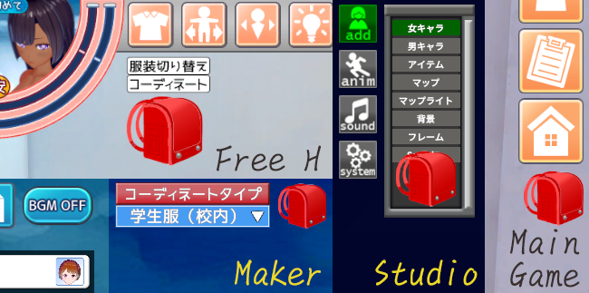
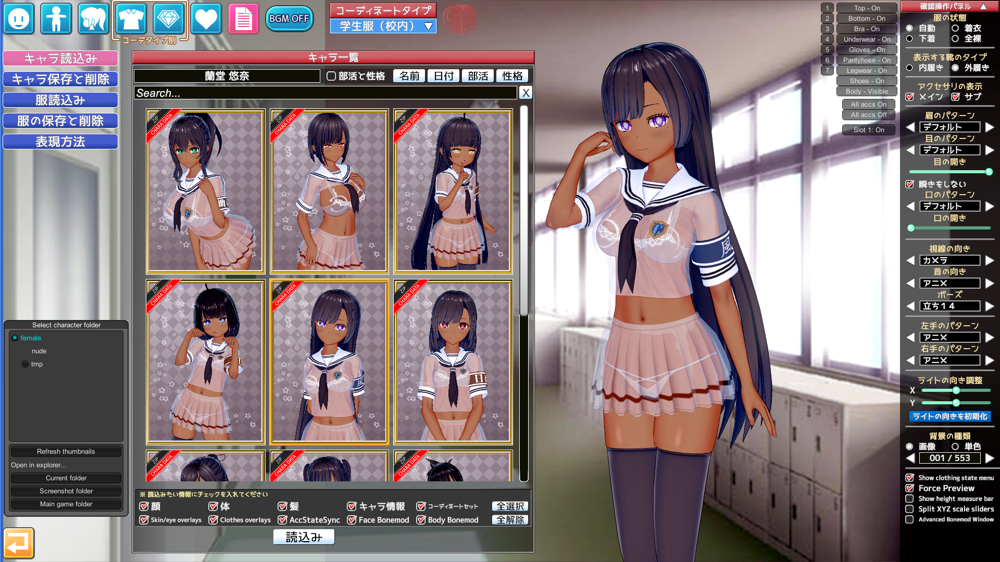
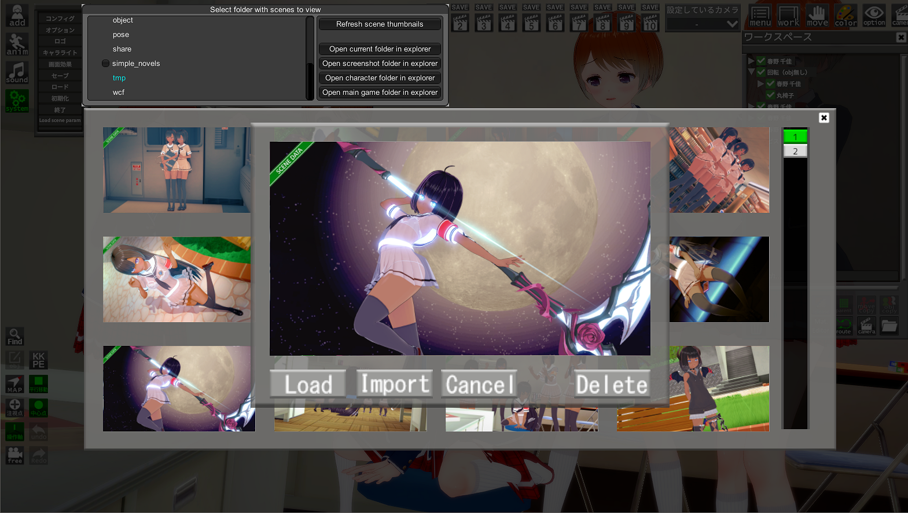
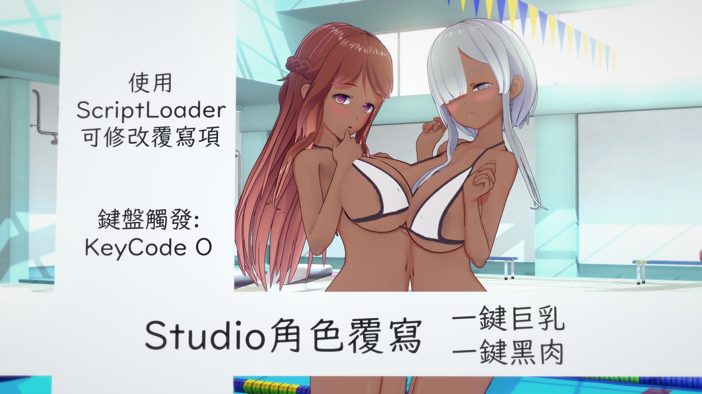

<a rel="license" href="LICENSE.html"> 本著作係採用創用 CC 姓名標示-**非商業性**-相同方式分享 3.0 台灣 授權條款授權.</a>

# Studio服裝卡選擇性載入插件 Studio Coordinate Load Option
 

- Studio的服裝卡讀取處，多一個選項盤可以選擇性載入服裝
- 配合ABMX V4.0起的服裝儲存功能，新增ABMX的獨立選擇項
- Chara Overlays Based On Coordinate的獨立選擇項
- 飾品: 
    - 取代模式: 複寫同一欄位的飾品
    - 增加模式: 往空欄位依序附加上去
    - 清除飾品: 一鍵清除角色當前服裝的所有飾品
    - 鎖定頭髮飾品: 可將頭髮飾品鎖定，使之不會受到清除和複寫
    - 反選頭髮飾品: 一鍵反向選擇所有頭髮飾品

**將「鎖定頭髮飾品」以外的鈎選項全勾，並使用飾品「取代模式」即會調用遊戲原始程式**

確定支援Plugin: 
- Koikatu Overlay Mods v5.1.2
- Koikatu ABMX V4.2
- Koikatu More Accessories v1.0.9
- Koikatu MaterialEditor **v1.10** (不支援v1.9)
- Koikatu HairAccessoryCustomizer v1.1.3
- Koikatu Chara Overlays Based On Coordinate **v1.3.4** (不支援v1.3.3)

# Studio全是妹子插件 Studio All Girls Plugin
 

- 將Studio SceneData內所有男性以女性讀入 
- 身體外型依照其原始數據女體化 
- 插件可從Configuration Manager關閉功能 

以此插件可以實現跨性別替換角色卡功能 
例: 讀取一般的男女Scene，將男角色替換成女角色，就變成了百合Scene! 

### **警語**: 
1. 所有角色將以女性載入，大胸肌會變成大奶子 
1. 此插件所產生之存檔，**所有角色皆會以女性存檔** 
1. POSE解鎖性別限制，男女都可讀取，寫入以女性寫入 

# Studio女體單色化插件 Studio Simple Color On Girls
 

使女性支持單色化功能，用意在於彌補全女插件所造成的限制 
可以和全女插件分開使用 
**依賴Darkness特典，無Darkness必定出問題** 

# Studio換人插件 Studio Chara Only Load Body
 

保留衣服和飾品，只替換人物 
目前確定支援Plugin: 
- Koikatu Overlay Mods v5.1.2
- Koikatu More Accessories v1.0.9
- Koikatu KK_UncensorSelector v3.9
- Koikatu KKABMX v4.2
- Koikatu Chara Overlays Based On Coordinate v1.3.4 (Chara Overlays跟著插件了，如果要更改載入與否請至設定修改)

# Studio IK→FK修正 Studio Reflect FK Fix
 
↑ 請點選圖片觀看範例影片 ↑ Click the image to watch demo! ↑  (備用載點: [影片1](demo/demo5-1.mp4) [影片2](demo/demo5-2.mp4) )

- 原始的「FKにポーズを反映」功能會複寫身體FK+脖子FK+手指FK 
→ 改成了只會複寫身體FK，脖子FK和手指FK維持原樣
- 原始的「FK 首 個別參照」功能，是直接複製アニメ的脖子方向 
→ 改成了會複製真實方向。意即可以使用「首操作 カメラ」定位後，再按我的「->FK(首)」按鈕複製至脖子FK

# Studio文字插件 Studio Text Plugin
 
↑ 請點選圖片觀看範例影片 ↑ Click the image to watch demo! ↑  (備用載點: [影片](demo/demo6.mp4)) 
- 從「add→アイテム→2D効果→文字Text」加載，右側選中後在anim選單編輯 
- 文字物件可修改字體、大小、樣式、顏色、錨點位置、對齊(換行後顯示選項) 
- 可保存文字設定，以作為NewText的預設參數 

建議分享Scene時一併分享使用的Font (It is recommended to share the Fonts used when sharing Scene.) 

### 注意事項: 
- Fonts會列出OS內安裝，支援Unity動態生成的所有字體，字體總數在500以下時可以顯示預覽 
- 若Scene保存後，在其他沒有安裝此Font的OS讀取，會加載MS Gothic 
- Color選取使用右下角遊戲原生Color選擇器 
- 文字中插入換行符「\n」可以換行，插入換行符後會顯示「對齊」編輯選項 
- 文字重疊時偶爾會渲染不正確，這是Unity的問題，似乎無解 

# Studio自動關閉Scene載入視窗 Studio Auto Close Loading Scene Window
 

Load Scene視窗處，在Import或Load後自動關閉視窗 
可以使用Configuration Manager個別設定Import/Load是否啟用 (預設皆啟用) 
**經確認可直接移植轉用至AI少女**，增加StudioNEOV2進入點

# 插件清單工具 Plugin List Tool
 

- 此工具可導出當前遊戲中已加載的BepInEx插件和IPA插件 
- 格式為**Json和CSV** 
- 適配IPALoaderX v1.2以上版本 
- 重新Enable後會立即倒出當前加載清單

# 開門查水表！ FBI Open Up！
 
↑ 請點選圖片觀看範例影片 ↑ Click the image to watch demo! ↑  (備用載點: [影片](demo/demo9.mp4)) 
- 此插件可依照原始角色，將她們轉變為小蘿莉 
- 支援替換模板角色，例如:
    - 若將模板自訂為巨乳姊姊，就可以轉變功能為替換成大姊姊
    - 將模板訂為三頭身(Chibi)並開啟ABMX設定，這就能成為三頭身變化功能
- 可在Main Game、Studio、Maker和Free H內執行 
- 我置入了幾張過場圖片和動畫，作為娛樂效果

詳細說明。如果你想要使用，我很確定你需要閱讀它

### 使用說明
 
1. 功能觸發圖標為一紅色書包，位置紀錄如下
    - Studio: 位在「Add」→「女角色」
    - Maker: 位在正上方之「衣裝切換欄」的右側
    - Free H: 位在左上角的「服裝」子選單之中
    - MainGame主遊戲: 位在滑鼠中鍵暫停時的右排按鍵最下方
2. **短按**一次**啟動\關閉**功能，並**替換\倒回**場景內的**所有角色** 
(Studio內**長按**可啟動\關閉功能但**不變更現有角色**)
3. 若功能開啟，Studio和Maker載入人物時人物會自動被替換 
這包含Studio的Scene存檔載入也會套用
4. 計算邏輯為: **新數據 = 原始數據 + ((模板數據 - 原始數據) * Change Rate)** 
此運算會套用至身體和臉部的所有原生數值 
(大致上等於Maker中身體\臉部頁籤最下面的所有陳列數值)
5. ABMX功能沒有計算，只能全部覆蓋，功能需要於設定中開啟。 **此功能設計用來三頭身化**

### Configure設定說明
- Change rate: 原始人物向模板人物改變的比例 數值為0(不改變)~1(全改變)。
- Enable: 是否啟用插件。 這同時反映在遊戲中的紅色書包圖標之明暗狀態。 Studio和Maker如果在啟用狀態載入新人物，新人物將會直接被替換。
- Effect on ABMX: 啟用ABMX覆寫功能 若啟用會把模板的ABMX全覆蓋至對象，且會禁用回退功能。 
- Sample chara: 模板人物路徑。 留空白即可使用預設人物。 可傳入絕對路徑或相對路徑，如「UserData/chara/female/*.png」。
- Video path: FBI.mp4影片的路徑 預設路徑為「UserData/audio/FBI.mp4」
- Video volume: 影片音量 預設為0.04，請視喜好自行調整。

### ※注意事項※
1. 雖然目前有作主遊戲之功能，但並未完整測試，且沒有計畫再完善它 
**主遊戲功能請單純作為附加功能視之**
1. Free H內沒有過場插圖；主遊戲沒有人物加亮動畫
1. 模板角色可在Configuration Manager設定內更改，製作要點請見後述
1. **如果不想要FBI影片，請移除mp4檔案即可**

### 模板角色製作指南
- 請製作出一個你心目中100%的角色存檔，例如: 100%的蘿莉、100%的御姊
- 對於ABMX數據，開啟功能後模板的ABMX是**完全覆蓋**對象人物，不受Change Rate影響 ABMX請只用在特殊身形，**例如三頭身化** 製做普通的模板時請不要使用ABMX
- 建議扒光她所有的衣服和飾品，以降低存檔體積和降低電腦負擔

# 需求依賴
- コイカツ！ ダークネス (Koikatu! Darkness) 
- **BepInEx v5.0.1** 
- BepisPlugins r13.1.1 
- Koikatu ABMX v3.5.1

# 安裝方式
- 將*.dll放至「BepInEx/plugins/jim60105」資料夾之下 
- 將*.mp4影片放至「UserData/audio」資料夾之下 (可選)

# 角色Overlay隨服裝變換 Chara Overlays Based On Coordinate
 
↑ 請點選圖片觀看完整影片 ↑ Click the image to watch full video! ↑  (備用載點: [影片](demo/demo10-1.mp4)) 

- 讓所有角色Overlay(Iris、Face、Body Overlay)隨著服裝變更，反映在人物存檔(CharaFile)和服裝存檔(CoordinateFile)上 
- 此插件在「讀存」跟「切換服裝」時覆蓋Overlay，依賴KSOX運作 
- **Iris Overlay可選只覆蓋在單眼**，可用此功能做異色瞳
- 支援資源重用，同樣的貼圖重複使用時只會佔一份空間 
- **產生的存檔可以和「無此插件的遊戲環境」相容**，此時KSOX儲存的Overlay會被載入 
(存檔時，當前套用的Overlay依然會儲存進去，並在無插件環境時被讀取出來) 

### 注意事項: 
- 特別需求 **KKAPI v1.9.5 & Illusion Overlay Mods v5.1.1** 以上版本 
- **預設不啟用服裝存檔功能，請至Configuration Manager確認所有儲存設定** 
- 以下狀況會顯示警示訊息 (警示可關閉)
    - 存角色時**有Overlay未被儲存**
    - 存服裝時存入了「**全無Overlay**」狀態 (如果開啟了服裝Coordinate儲存功能，但是卻沒有存入任何角色Overlay，**就會發生如「清除角色Overlay」的效果**)
- 強烈建議**只在需要時開啟服裝儲存**功能
- v1.2.3後的版本產生的存檔不能在更舊的版本中讀取，請更新

# 存檔尺寸調整工具 PNG Capture Size Modifier
 
 

- 可調角色存檔(ChaFile)、服裝存檔(CoordinateFile)、Studio存檔(Scene)的圖片分辨率 
- CharaMaker中，角色、服裝檔案選擇器的顯示列數可調整 
- 放大Studio SceneData選擇器的選中預覧 
- (可選)給角色存檔(ChaFile)、Studio存檔(Scene)加上浮水印角標 

**請至設定中調整這些功能** 
因為改變了存檔圖片尺寸，**強烈建議不要禁用Studio SceneData浮水印**，以利區分存檔PNG和普通截圖PNG 
**產生的存檔可以在「無此插件的遊戲環境」讀取** 
如果你不需要拍攝大圖，請至Config調整截圖倍率為1倍

# Studio千佳替換器 Studio Chika Replacer
 

- 一鍵把Studio內的所有女角色都換成千佳(預設角色)，並保留原始人物的身形數據 
- 或可自訂要用來替換的角色 
- 可只替換選中的角色 
- 用選擇方式來替換時，可替換男角色 

快捷鍵我故意設定得的很複雜，以免誤觸 (可在config修改) 
全替換: Enter + 右Shift + 左Shift + 左Ctrl 
選擇替換: '(單引號) + 右Shift + 左Shift + 左Ctrl 

# Studio角色光綁定視角 Studio Chara Light Linked To Camera
 

- 將Studio角色光和視角間之旋轉值連動
- 鎖定狀態能隨著SceneData儲存

### 使用範例: 
調整角色光為「右側背光，左側是面光」然後鎖定 
則不論視角如何旋轉，都會維持是畫面右側背光

# Studio 雙螢幕 Studio Dual Screen
 
↑ 請點選圖片觀看範例影片 ↑ Click the image to watch video! ↑  (備用載點: [影片](demo/demo14.mp4)) 
- 在VMD錄屏的同時操作UI或調整物件
- 第二顯示器固定視角，並在主顯示器調整物件

功能:
- 啟用Studio的第二顯示器功能
- UI只會顯示在主顯示畫面
- Frame會顯示在雙畫面
- VMD和KK_StudioCharaLightLinkedToCamera會作用在第二畫面
- 脖子和目光朝向第二畫面
- 可固定副顯示器的視角，使滑鼠操作和Camera1~10不會移動副顯示器 (鍵盤操作仍會反應)

### 注意:
- **必需要有雙實體顯示器才能使用**
- 兩個預設快捷鍵皆為「未設定」，到Config設定後才能使用
- 副顯示器固定後，或修改畫面設定(濾鏡等)後，需要再次觸發啟動快捷鍵以進行畫面同步
- 已知問題: 啟用雙螢幕後F9截圖會造成無回應，請改用F11 (目前沒有計劃深入這部份)

# Studio 角色覆寫腳本 Studio Body Overwrite Script
 
這個不是Plugin而是Script，**請用[ScriptLoader](https://github.com/denikson/BepInEx.ScriptLoader)載入執行** 
請手動編輯.cs檔，將內容修改為你要覆寫的數值 
數值等於Maker中的數字除以100 (即遊戲內數值89 = 0.89f)；Color為Color(r, g, b, a) 
不需覆寫的項目請在開頭加上「//」做行註解 
**Studio中以O鍵觸發**

安裝方式

1. 安裝[ScriptLoader](https://github.com/denikson/BepInEx.ScriptLoader) 
2. 將*.cs置於「Koikatu/scripts」下

# 需求依賴
- コイカツ！ ダークネス (Koikatu! Darkness) 不相容於Steam Koikatsu Party
- **BepInEx v5.0.1** 
- BepisPlugins r13.1.1 

# 安裝方式
- 參考壓縮檔結構，將文件放進「BepInEx/plugins/jim60105」資料夾之下 

# 下載位置
[Latest Release](https://github.com/jim60105/KK/releases/latest "Latest Release")
